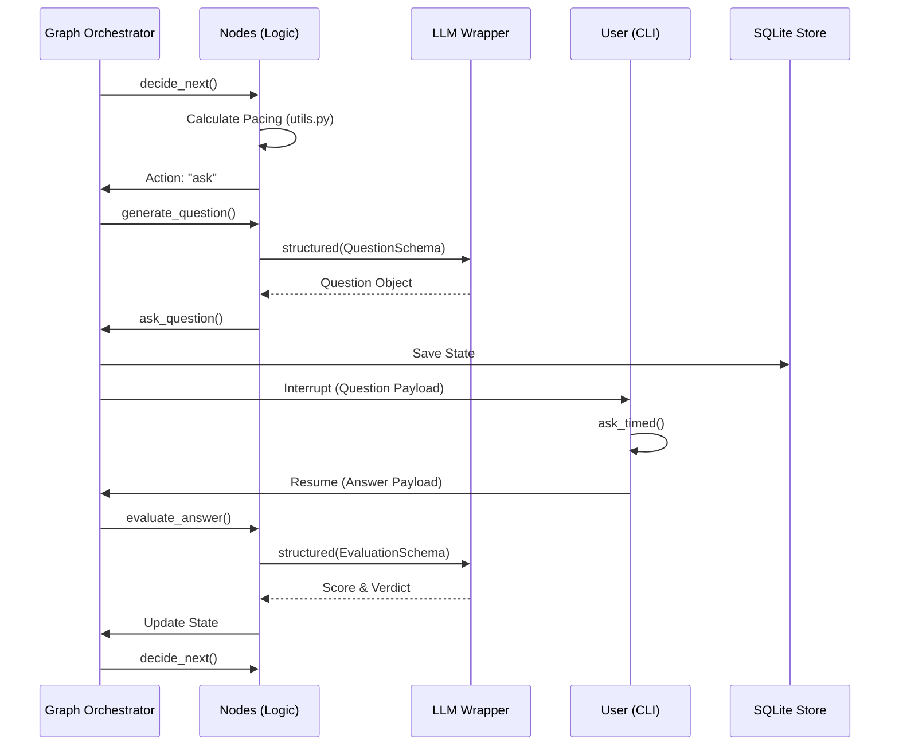

# Low-Level Design (LLD) Specification: AI Interviewer Agent Module

  **Project:** AI Interviewer
  **Module:** `agent`
  **Version:** 1.0.0
  **Status:** Final
  **Date:** 2026-09-16

---

## 1. Introduction

### 1.1 Purpose

  The `agent` module serves as the core intelligence engine of the AI Interviewer. Its primary objective is to transform static input documents (Job
  Descriptions and Resumes) into a dynamic, time-boxed, and objectively scored technical interview.

### 1.2 Scope

  This document covers the internal logic of the `agent` directory, including the state machine orchestration, the LLM integration layer, the
  timing/pacing mathematical models, and the reporting engine.

### 1.3 Design Philosophy

- **State-Driven**: The system is modeled as a Finite State Machine (FSM) via LangGraph to ensure deterministic transitions.
- **Contract-First**: Every LLM interaction is governed by a Pydantic schema to eliminate "hallucinated" output formats.
- **Time-Centric**: All logic is wrapped around a "Time Budget," treating seconds as the primary resource to be allocated and consumed.

---

## 2. System Architecture

### 2.1 Architectural Pattern

  The module implements the **Saga Pattern** (via LangGraph) for long-running transactions that can be interrupted and resumed.

### 2.2 Component Topology

| Component                                          | Responsibility                                              | Dependency             |
| :------------------------------------------------- | :---------------------------------------------------------- | :--------------------- |
| **State Manager** (`state.py`)             | Defines the global state schema and data models.            | Pydantic               |
| **Orchestrator** (`graph.py`)              | Defines the nodes and the edges of the interview flow.      | LangGraph              |
| **Execution Nodes** (`nodes.py`)           | Implements the business logic for each graph step.          | `llm`, `utils`     |
| **LLM Wrapper** (`llm.py`)                 | Manages API communication and structured output validation. | OpenRouter / LangChain |
| **Math Engine** (`utils.py`)               | Handles time allocation and pacing calculations.            | Standard Library       |
| **I/O Layer** (`loaders.py`, `timer.py`) | Handles document extraction and real-time user input.       | PyPDF, Prompt-Toolkit  |
| **Reporting Engine** (`reporting.py`)      | Aggregates state into final evaluation documents.           | Markdown/JSON          |

---

## 3. Data Model Design

### 3.1 Global State: `InterviewState`

  The system utilizes a `TypedDict` that persists across the graph.

| Field                         | Type                    | Role                                | Accumulator      |
| :---------------------------- | :---------------------- | :---------------------------------- | :--------------- |
| `resume_text` / `jd_text` | `str`                 | Input raw data.                     | Overwrite        |
| `topics`                    | `list[Topic]`         | The planned interview syllabus.     | Overwrite        |
| `topic_runs`                | `dict[str, TopicRun]` | Live progress per topic.            | Overwrite        |
| `transcript`                | `list[Event]`         | Chronological log of the interview. | `operator.add` |
| `evaluations`               | `list[Evaluation]`    | Scoring data for each answer.       | `operator.add` |
| `discrepancies`             | `list[Discrepancy]`   | Resume vs. Answer contradictions.   | `operator.add` |

### 3.2 Core Pydantic Models

#### `Topic`

- `id`: Unique slug (e.g., `python-concurrency`).
- `priority`: Integer (1-5).
- `target_depth`: Integer (1-5).
- `allocated_seconds`: Calculated budget based on priority.

#### `TopicRun`

- `status`: `pending` $\rightarrow$ `active` $\rightarrow$ `covered` / `skipped`.
- `depth_reached`: Integer (0-5).
- `difficulty`: Dynamic integer (1-5) that scales based on candidate performance.

#### `Evaluation`

- Dimensions (1-5): `relevance`, `depth`, `specificity`, `correctness`, `communication`.
- `contradicts_resume`: Boolean flag for integrity checks.

---

## 4. Detailed Component Logic

### 4.1 The Pacing Algorithm (`utils.py`)

  The pacing engine prevents the interview from overrunning its budget while ensuring high-priority topics are covered.

  **Time Allocation Formula:**

$$
$$ \text{Topic Budget} = \text{Total Budget} \times (1 - \text{Reserve}) \times \frac{\text{Topic Priority}}{\sum \text{All Priorities}}
$$

  *Constraint: Every topic must meet a `min_topic_seconds` (150s) or be dropped.*

  **Pacing State Transitions:**

| Current State    | Condition                                  | Next Action    |
| :--------------- | :----------------------------------------- | :------------- |
| `Active Topic` | `depth_reached` $\ge$ `target_depth` | `next_topic` |
| `Active Topic` | `elapsed_s` $\ge$ `allocated_s`      | `next_topic` |
| `Global Loop`  | `remaining_s` $\le$ `reserve_s`      | `wrap_up`    |
| `Global Loop`  | `questions_in_topic` $\ge 5$           | `next_topic` |

### 4.2 The LLM Structured Interface (`llm.py`)

  To ensure 100% reliability of JSON outputs, the module implements a **Validation-Feedback Loop**:

1. **Prompt**: System Prompt + Pydantic JSON Schema $\rightarrow$ LLM.
2. **Extraction**: Regex-based cleaning of markdown fences.
3. **Validation**: `model_validate_json()`.
4. **Correction**: If validation fails, the `ValidationError` is sent back to the LLM as a new prompt: *"Your last response failed validation:
   [Error]. Please correct it."*

### 4.3 The Interrupt Mechanism (`nodes.py` $\rightarrow$ `main.py`)

  The `ask_question` node utilizes LangGraph's `interrupt()` function.

- **Execution Pause**: The graph state is serialized to SQLite and execution stops.
- **External Trigger**: The CLI (`main.py`) captures the interrupt, renders the question, and waits for `ask_timed()`.
- **Resume**: The CLI sends a `Command(resume=...)` which injects the user's answer back into the state and wakes the graph.

---

## 5. Sequence Diagrams

### 5.1 The Core Interview Cycle

  ---

  